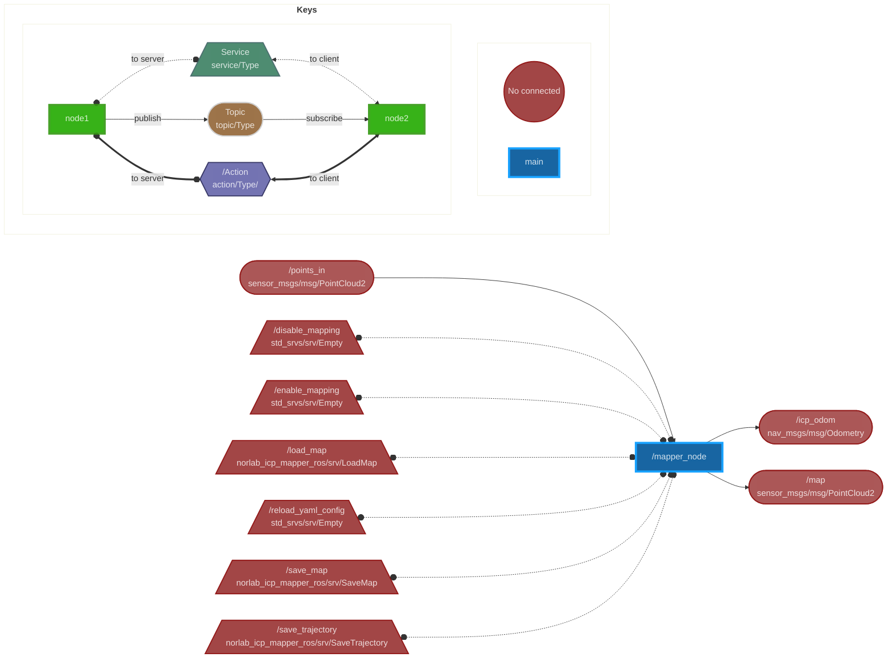

# norlab_icp_mapper_ros
A bridge between norlab_icp_mapper and ROS.

## Node Parameters
|               Name                |                                                 Description                                                 |         Possible values          |                       Default Value                        |
| :-------------------------------: | :---------------------------------------------------------------------------------------------------------: | :------------------------------: | :--------------------------------------------------------: |
|            odom_frame             |                                          Frame used for odometry.                                           |            Any string            |                           "odom"                           |
|            robot_frame            |                                        Frame centered on the robot.                                         |            Any string            |                        "base_link"                         |
|       initial_map_file_name       |                           Path of the file from which the initial map is loaded.                            |          Any file path           |                             ""                             |
|        initial_robot_pose         | Transformation matrix in homogeneous coordinates describing the initial pose of the robot in the map frame. |  Any matrix of dimension 3 or 4  | "[[1, 0, 0, 0], [0, 1, 0, 0], [0, 0, 1, 0], [0, 0, 0, 1]]" |
|        final_map_file_name        |                  Path of the file in which the final map is saved when is_online is false.                  |          Any file path           |                         "map.vtk"                          |
|    final_trajectory_file_name     |              Path of the file in which the final trajectory is saved when is_online is false.               |          Any file path           |                      "trajectory.vtk"                      |
|            icp_config             |                         Path of the file containing the libpointmatcher icp config.                         |          Any file path           |                             ""                             |
|       input_filters_config        |                    Path of the file containing the filters applied to the sensor points.                    |          Any file path           |                             ""                             |
|      map_post_filters_config      |                Path of the file containing the filters applied to the map after the update.                 |          Any file path           |                             ""                             |
|       map_update_condition        |                                          Condition for map update.                                          | {"overlap", "delay", "distance"} |                         "overlap"                          |
|        map_update_overlap         |                    Overlap between sensor and map points under which the map is updated.                    |              [0, 1]              |                            0.9                             |
|         map_update_delay          |                   Delay since last map update over which the map is updated (in seconds).                   |              [0, ∞)              |                            1.0                             |
|        map_update_distance        |             Euclidean distance from last map update over which the map is updated (in meters).              |              [0, ∞)              |                            0.5                             |
|         map_publish_rate          |      Rate at which the map is published (in Hertz). It can be slower depending on the map update rate.      |              (0, ∞)              |                            10.0                            |
|        map_tf_publish_rate        |                              Rate at which the map tf is published (in Hertz).                              |              (0, ∞)              |                            10.0                            |
|           max_idle_time           |           Delay to wait being idle before shutting down ROS when is_online is false (in seconds).           |              [0, ∞)              |                            10.0                            |
|        min_dist_new_point         |        Distance from current map points under which a new point is not added to the map (in meters).        |              [0, ∞)              |                            0.03                            |
|         sensor_max_range          |                             Maximum reading distance of the laser (in meters).                              |              [0, ∞)              |                            80.0                            |
|           prior_dynamic           |                                A priori probability of points being dynamic.                                |              [0, 1]              |                            0.6                             |
|         threshold_dynamic         |                       Probability at which a point is considered permanently dynamic.                       |              [0, 1]              |                            0.9                             |
|          beam_half_angle          |                     Half angle of the cones formed by the sensor laser beams (in rad).                      |             [0, π/2]             |                            0.01                            |
|             epsilon_a             |                                 Error proportional to the sensor distance.                                  |              [0, ∞)              |                            0.01                            |
|             epsilon_d             |                                Fix error on the sensor distance (in meters).                                |              [0, ∞)              |                            0.01                            |
|               alpha               |                       Probability of staying static given that the point was static.                        |              [0, 1]              |                            0.8                             |
|               beta                |                      Probability of staying dynamic given that the point was dynamic.                       |              [0, 1]              |                            0.99                            |
|               is_3D               |                       true when a 3D sensor is used, false when a 2D sensor is used.                        |          {true, false}           |                            true                            |
|             is_online             |                            true when online mapping is wanted, false otherwise.                             |          {true, false}           |                            true                            |
|       compute_prob_dynamic        |          true when computation of probability of points being dynamic is wanted, false otherwise.           |          {true, false}           |                           false                            |
|            is_mapping             |                  true when map updates are wanted, false when only localization is wanted.                  |          {true, false}           |                            true                            |
|   save_map_cells_on_hard_drive    |      true when map cell storage on hard drive is wanted, false when map cell storage in RAM is wanted.      |          {true, false}           |                            true                            |
| publish_tfs_between_registrations |      When false, the map tf is published only after registration. Otherwise with map_tf_publish_rate.       |          {true, false}           |                            true                            |

## Node Topics
|   Name    |                     Description                     |
| :-------: | :-------------------------------------------------: |
| points_in |  Topic from which the input points are retrieved.   |
|    map    |        Topic in which the map is published.         |
| icp_odom  | Topic in which the corrected odometry is published. |

## Node Services
|        Name        |          Description          | Parameter Name |               Parameter Description                |
| :----------------: | :---------------------------: | :------------: | :------------------------------------------------: |
|      save_map      |    Saves the current map.     |    filename    |    Path of the file in which the map is saved.     |
|  save_trajectory   | Saves the current trajectory. |    filename    | Path of the file in which the trajectory is saved. |
| reload_yaml_config | Reload all YAML config files. |                |                                                    |

## Mapper Node Graph

